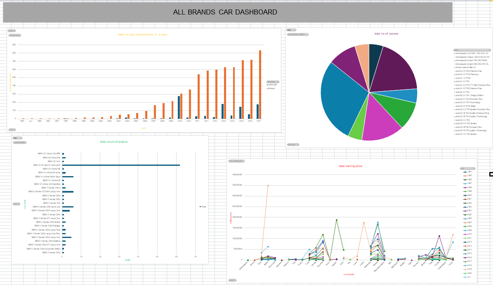

# car-sales-dashboard
A car sales dashboard visualization provides a comprehensive overview of sales performance and trends. It typically includes:  CAR NAME,CAR BRAND,SELLING PRICE,KM DRIVEN,YEAR,NO OF DRIVERS,NO OF OWNERS,SEATS,SELLING TYPE,ENGINE,TRANSMISSION..

 
INSIGHTS:
 
1.The first dashboard represent the TOTAL NUMBER OF TRANSMISSION IN A YEAR.This dashboard represent the CLUSTERED COLUMN dashboard.In this we represent the year on x axis and no of transmission on y axis, we use filter as brand names.
 
2.The second dashboard represent the TOTAL COUNT OF ENGINE.This dashboard represent the CLUSTERED BAR dashboard.In this we represent seats on x axis and car names on y axis and we use filter as brand names.
 
3.The third dashboard represent the TOTAL NUMBER OF OWNERS.This dashboard represent the PIE CHART.In this we represent the seller type,sum of number of owners and names, we use filter as brand names.
 
4.The fourth dashboard represent the SELLING PRICE.This dashboard represent the LINE CHART.In this we represent the car brands on x axis,selling price on y axisand w use brands as filter.
 
email:paravadasivasai@gmail.com
 
linkedin:www.linkedin.com/in/paravada-sivasai-12258224b
