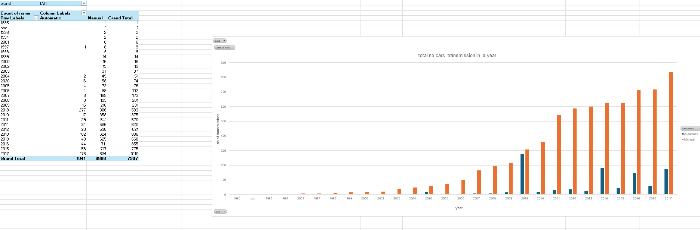

# car-sales-dashboard
A car sales dashboard visualization provides a comprehensive overview of sales performance and trends. It typically includes:  CAR NAME,CAR BRAND,SELLING PRICE,KM DRIVEN,YEAR,NO OF DRIVERS,NO OF OWNERS,SEATS,SELLING TYPE,ENGINE,TRANSMISSION..

